<!-- ───────────── header ───────────── -->
<picture>
  <source media="(prefers-color-scheme: dark)" srcset="./assets/header-dark.svg">
  
</picture>

  

  
  
  

 

## 👋 About Me

I'm Annie, a junior-year student who **designs and builds** for the web. I like taking an idea from a rough sketch in Figma all the way to a responsive, accessible product people can actually use, and I'm growing into a full-stack developer one project at a time.

- 🌱 **Currently exploring** — full-stack apps with **Next.js** and **Supabase**, and machine learning in the browser
- 🎨 **I care about** — clean interfaces, accessibility, and details that make things feel easy
- 🤝 **Open to** — collaborations, freelance work, and internships

## 🧭 How Can I Help

| | Service | The short version |
|:-:|---|---|
| `01` | **Product Design** | Designing clear, intuitive, and responsive digital experiences, from early concepts to polished interfaces. |
| `02` | **Web Product Development** | Turning product ideas into responsive, interactive, and production-ready web applications. |
| `03` | **UI/UX Delivery** | Taking interfaces from design to a polished, accessible product, and refining them based on how people actually use them. |

## 🚀 Selected Work

<table>
  <tr>
    <td width="50%" valign="top">
      <h3>♻️ Smart Waste Classifier</h3>
      
A <b>computer vision</b> project that classifies waste from a photo into <b>six categories</b> and gives disposal guidance, running <b>entirely in the browser</b>.

      

        
        
        
      

      
      
    </td>
    <td width="50%" valign="top">
      <h3>🎓 Teech</h3>
      
A <b>consultation platform</b> that gives students and faculty a clearer way to connect, from <b>finding available instructors</b> to <b>booking consultations</b>.

      

        
        
        
        
      

      
      
    </td>
  </tr>
  <tr>
    <td width="50%" valign="top">
      <h3>👕 School Uniform Exchange</h3>
      
A <b>full-stack marketplace</b> where students <b>buy, sell, and swap</b> second-hand school uniforms, making them more affordable, accessible, and sustainable.

      

        
        
        
        
      

      
      
    </td>
    <td width="50%" valign="top">
      <h3>✅ Awesome Todos</h3>
      
A simple <b>task manager</b> for creating, organizing, and tracking to-dos through a <b>clean, straightforward interface</b>.

      

        
        
        
      

      
      
    </td>
  </tr>
</table>

  

## 🧰 Tech Stack

 

  

## 📓 From the Journal

Notes on college, growth, and figuring things out.

| | Entry | Date |
|:-:|---|---|
| `01` | [**Still Figuring Things Out**](https://anniesrdnl-portfolio.vercel.app/#journal) | July 2026 |
| `02` | [**One Deadline at a Time**](https://anniesrdnl-portfolio.vercel.app/#journal) | May 2026 |
| `03` | [**More Than Just Grades**](https://anniesrdnl-portfolio.vercel.app/#journal) | February 2026 |

## 🤝 Let's Build Something

Have a product idea or a process that needs automating? Let's talk about turning it into a working system. See more on my [**portfolio**](https://anniesrdnl-portfolio.vercel.app/) or reach me at [**anniesardiniola@gmail.com**](mailto:anniesardiniola@gmail.com).

 

<!-- ───────────── footer ───────────── -->
<a href="mailto:anniesardiniola@gmail.com">
  <picture>
    <source media="(prefers-color-scheme: dark)" srcset="./assets/footer-dark.svg">
    
  </picture>
</a>
